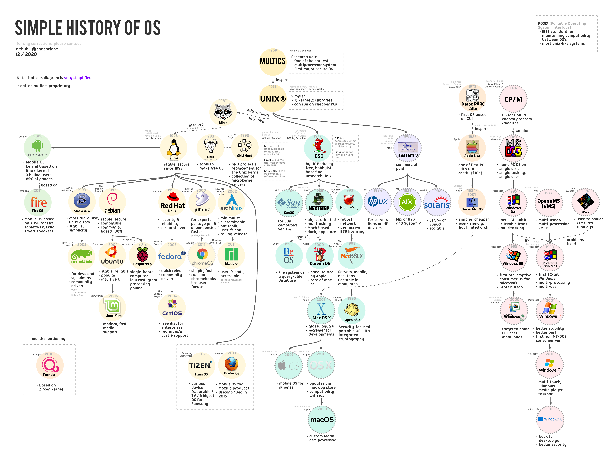

# ☕✨cup-of-OS✨
Easy sips of basic concepts of OS #tldr #eli5

Presentation [here](https://docs.google.com/presentation/d/1ya2-NfS2mJQ-V4qFdMmBMXSjMTHaSbZGE-x8RvJ-wiM/edit?usp=sharing) on 12/27/2020 by [chococigar@](https://github.com/chococigar)

// Please PR on any info that needs correction or addition.

## what we'll cover
1. History of OS - why we have it in the first place
    - Unix variants,  MS DOS, Posix, etc
    - Important people and important companies
2. Components of OS and its key philosophy
    - kernels, ABIs, abstraction, etc
3. Q&A
    - Answering previously asked questions

## History of OS

### In the beginning...
There was just one job.

In 1950's, computers could execute only one program at a time. (ex: with punched paper cards.)
But as computers got fast, there was a need to utilize resources better.

We needed things like: 
1. Batch programming
2. Multitasking
3. Time-sharing
4. Memory protection

Also there were different computers, so we needed some compatibility / editability in OS.

* Please reference comments from [r/linux](https://www.reddit.com/r/linux/comments/kporah/i_made_a_simple_diagram_on_history_of_os_feel/) and [r/compsci](https://www.reddit.com/r/compsci/comments/kposlx/i_made_a_simple_diagram_on_history_of_os_feel/), where I posted this diagram and iteratively updated based on feedbacks.

### Mainframes and Microcomputers

### Multics and Unix
#### Multics to Unix
* Multics (1969)
    * Created by AT&T's Bell.
    * Most influential early time-sharing OS with multiprocessor systems. First major OS that is secure. Commercial success. But there was a drawback:
    > "It was over-ngineered... there was just too much of it." - Dennis
    > "Easily half of the code I was writing was error recovery code." - Ken 

* Unix
    * Created by Ken Thompson & Dennis Ritchie, frustrated in working in Multics.
        * Ken Thompson: 
            * Made Go lang
            * Made UTF8
        * Dennis Ritchie: 
            * Made C
    * UNICS (Uniplexed Information and Computing Service)
    * Two components
        * Core (kernel❤️): memory managing, multitasking
        * Libraries / programs
    * If it crashes, we’ll just show kernel panic & tell user to reboot ¯\_(ツ)_/¯
        → This simplicity allowed Unix to run cheaper, making it available on simple hardware.
        
#### Unix versions: BSD is edu/hobbylist, Sys-V is enterprise version.
 * BSD (Berkely Software Distribution), by UC Berkeley / free / hobbyist / based on Research Unix. BSD is a complete system (kernel, drivers, utilities, etc) whereas Linux only has kernels, drivers, and libs.
    * 1982: Sun Microsystems creates SunOS
    * 1989: NeXT creates NEXTSTEP, an object-oriented, multitasking OS based on Mach with dock and app store.
        * 2000: Apple creates Darwin OS, which will later become Mac OS.
    * 1993: FreeBSD, which has robust network and has permissive BSD licensing.
 * System V
    * 1984: HP creates hp UX for servers, which runs on HP devices.
    * 1986: IBM creates AIX, which is a mix of BSD and System V.
    * 1992: Sun Microsystems creates Solaris, which is System V version of Sun OS.
 
### Linux

#### Notes
* GNU is a set of rules with tools to make free unix-like OS
* Linux is a kernel that can be used with GNU
* GNU/Linux is the OS commonly referred as Linux

There are many variants in Linux, whose importance can be highly arguable. We are covering only the most significant distributions.
* 1987: Andrew S. Tanenbaum creates Minix, a unix-like OS for educational purposes.
* 1993: Linus Torvalds creates Linux, a stable, secure OS. It was inspired from Minix but did not have Minix code. [Linux PSA email from Linus to Minix community](https://images.techhive.com/images/article/2016/08/linus-original-email-1-100678574-large.jpg)
* 1993: Debian - stable, secure / compatible / community based 100%
    * 2004: Ubuntu - stable, reliable / popular / intuitive UI
    * 2006: Linux Mint - modern, fast / media support
* 1995: Red hat Linux - stable / corporate version 
    * 2003: Fedora - quick releases/ community driven
    * 2004: CentOS - free distribution for enterprises / RedHat without cost & support
* 2000: Gentoo Linux - for experts / portage package manager & dependencies / faster
    * 2011: chromeOS by Google - simple, fast / runs on Chromebooks / browser focused
* 2002: archlinux - minimalist / customizable / not really user-friendly
* 2005: openSUSE - for devs and sysadmins / community driven

### Apple (and Xerox)
* 1973: Xerox announces [Xerox Alto](https://history-computer.com/xerox-alto-complete-history-of-the-xerox-alto-computer/), the first OS based on GUI.
* 1979: Steve Jobs [visit Xerox PARC](https://web.stanford.edu/dept/SUL/sites/mac/parc.html), which inspired the potential of a GUI.
* 1983: Apple announces Apple Lisa, the first PC with GUI.
* 1984-2001: Apple release Classic MAC OS's for Macintosh PCs, which made GUI popular.
* 2001: Apple switches its OS to a BSD-based (Darwin OS, NEXTSTEP)
* 2007: Apple announces iOS, a mobile OS for iPhones based on Mac OS.

### Windows
* MS DOS line
    * 1974: CP/M created by Gary Kindall (Father of PC OS) & Digital Research. CP/M, which stands for Control Prgoram / Monitor, is OS for 8 bit PC. 
    * 1981: MS DOS created by Microsoft, which is very similar to CP/M. IT is a popular OS for hope PCs on single disk. Since PC's started becoming cheaper & simpler, a simple & light OS like MS DOS was suitable. However, it lacked multitasking and memory protection
* Windows NT line
    * 1977: VMS created OpenVMS(VMS), which is multi-user & multi-procesing VM OS.
    * 1993: Microsoft Windows NT was inspired from VMS, which is the first 32-bit Windows.
        * Security (historically) criticized by customers
            * 1990s: lacked memory protection, Blue screen of death!
    * 2001: Microsoft announces Windows XP, which has better UI and has home & professional versions.
    * 2015: Microsoft announces Windows 10, which has fast startup and is more secure. It also announces Microsoft edge browser.
       

## References
* [Operating Systems: Crash Course Computer Science #18](https://youtu.be/26QPDBe-NB8)
