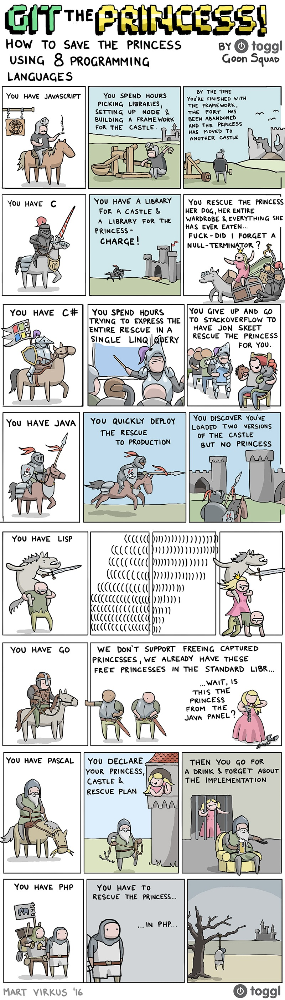

# ☕✨cup-of-CS-lang✨
Easy sips of basic concepts of CS lang #tldr #eli5

Presentation [here](https://docs.google.com/presentation/d/1RVt7Ytw8Bt5KTr57FC7f98kHuGEQrbvHDeGzXqiQXLo/edit?usp=sharing) on 1/24/2021 by [chococigar@](https://github.com/chococigar)

// Please PR on any info that needs correction or addition.

## what we'll cover
1. Intro: what languages we've come across, and their characteristics
    - Why are there so many languages?
2. Key concepts of a programming language
3. Q&A
    - Answering previously asked questions

## (Discussion) Languages we've came across, and their use-cases/properties
* Python
    * personal use: [CS101](http://cs101.kaist.ac.kr/), algorithms, ML, data crawling, general code
    * 
* Java
    * personal use: Data Structures course, Android
* Javascript
    * personal use: Most web browsers
* C++
    * personal use: [KENS](https://an.kaist.ac.kr/courses/2005/cs441/docs/UserGuide.html), 
* C
    * personal use: [Pintos](https://web.stanford.edu/class/cs140/projects/pintos/pintos.pdf)
* Racket
    * personal use
* Assembly
    * personal use
* Bash
    * personal use
* SQL
    * personal use
* HTML, CSS
    * personal use
* Rust
    * personal use
* Go
    * personal use
* Kotlin
    * personal use
* Typescript
    * personal use
* Dart
    * personal use

## 5 Major components of a CS language
// as defined by [Gary](https://youtu.be/GI_V3yzVDtA))
1. How it is run
2. Typing
3. Object-oriented vs. Functional
4. Garbage Collector
5. Concurrency

## Questions
1. What is the philosophical difference between Python and Javascript? (or Python and C++?)
2. Why does a language become trendy/popular? How did trends in Python/JS come about? What languages would be created in the future?
3. Python is popular in ML, but wasn’t the use-case when it was initially made.  Will there be a language with ML-specific use case?
4. What are pros and cons of an intermediate language (as opposed to compiled and interpreted?)
5. Are compilers OS-specific?
6. What’s llvm and why do compiler geeks like it?
7. Are Android apps JVM compatible? How does Java run in different environments?
8. How do I build my own CS language?

## References
* [Gary Explains - Different Types of Programming Languages](https://youtu.be/GI_V3yzVDtA)
* [Crash Course Computer Science #11 - The First Programming Languages](https://youtu.be/RU1u-js7db8)
* [Destroy All Software - Strong and Weak typing](https://www.destroyallsoftware.com/compendium/strong-and-weak-typing?share_key=6b0dd1ec18ab6102)
* [Typing: dynamic vs. static and weak vs. strong](https://en.hexlet.io/courses/intro_to_programming/lessons/types/theory_unit)
* [Hackernoon - I Finally Understand Static vs. Dynamic Typing and You Will Too!](https://hackernoon.com/i-finally-understand-static-vs-dynamic-typing-and-you-will-too-ad0c2bd0acc7)
* [Stefen Mischook - 10 Programming languages in only 15 minutes](https://youtu.be/7bE2mI4ePeU)
