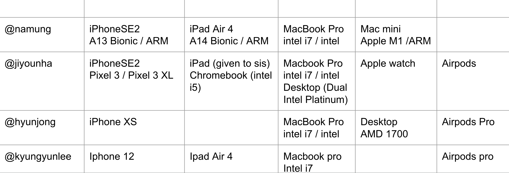

# ✨cup-of-cs-arm🌰✨

Presentation [here](https://docs.google.com/presentation/d/1tyjcIKm3L_xdkjfIuCHWcruoNn0rhefZunncKkhxwEk/edit?usp=sharing) on 1/31/2021 by [@Aningaaq](https://github.com/Aningaaq)

---

Today's session focuses more on the business and history of CPU Architectures

- [ ]  First step to become a processor Geek !

# [Survey] Which devices do you own?
What are their cpu architectures?

- TL;DR : All phones and tablets owned by cup o' cs members are ARM, Laptops are all Intel, 1 ARM desktop and AMD desktop.

# Intel🤷 vs AMD🤷‍♀️ vs ARM🤷‍♂️ ????

📌 Intel & AMD are both Chip Manufacturers

📌 Arm doesn’t make chips, they sell licences of ARM chip designs to other manufacturers.

📌 Intel designs and manufactures x86 processors

📌 AMD used to manufacture chips, but now outsources manufacturing to other companies.

## List of CPU manufacturers

Source: [https://en.wikipedia.org/wiki/List_of_computer_hardware_manufacturers](https://en.wikipedia.org/wiki/List_of_computer_hardware_manufacturers)

# Quick history of x86

Reference : [https://youtu.be/AADZo73yrq4](https://youtu.be/AADZo73yrq4)

- Started in 1986, by Robert Noyce & Gordon Moore (of Moore’s law)
- Intel 4004 in 1970 - 4 bit CPU
- 8008, 8080 in 1972 and 1974
- 8086 in 1978, head of the x86 family - 16 bit CPU
- 80186, 80286 in 1982 - 80286 had virtual addressing & on-chip MMU (protected mode)
- 80386 - 32 bit CPU, protected mode, released 1985.
    - Linux developed on 80386 starting in 1991.
- AMD Am386 was 80386 clone released in 1991.
- 486 in 1989 along with clones from AMD and Cyrix
- Pentium (i.e. 586) in 1993 plus clones
    - Named the “Pentium” for copyright, trademark issues
- Pentium Pro, Pentium Ⅱ & Ⅲ (i.e. 686) from 1995 to 1997
- Pentium 4 in 2000
- In 2001 Intel tried to escape x86 and launched the doomed 64-bit Itanium
    - Itanium failed, because it wasn’t backwards compatible
- 2003 AMD releases Athlon 64 with AMD64, 64-bit instruction set
- 2004 EM64T - Intel’s version of 64-bit x86

Some people like to call Intel’s 64-bit Instruction Set Architecture
as AMD64  (Because AMD was there first!)
Now known collectively as x86-64 or x64

- 2005 Apple moves from Power PC to Intel x86
- 2006 First Macs with 64bit Intel Processors
- 2008 to Present - i3, i5, i7, i9
- 2020 Apple moves from Intel x86-64 to its own chips based on Arm

## Q: Why aren't there Intel chips in mobile devices?

Source: [https://thenextweb.com/apple/2011/10/26/steve-jobs-intels-inflexibility-led-to-creation-of-a4-a5-processors/](https://thenextweb.com/apple/2011/10/26/steve-jobs-intels-inflexibility-led-to-creation-of-a4-a5-processors/)

- They were too… rigid? Inflexible…?
    - Intel used to manufacture most of the cpus in the world
- They design, & manufacture
- Couldn’t streamline the process for a brand new market
- Also neglected the mobile market
    - Didn’t think mobile infrastructure was stable enough for future market

### Intel did try though...

Source: [https://www.extremetech.com/computing/227816-how-intel-lost-the-mobile-market-part-2-the-rise-and-neglect-of-atom](https://www.extremetech.com/computing/227816-how-intel-lost-the-mobile-market-part-2-the-rise-and-neglect-of-atom)

- They did have the Atom Processor

    Low power chip designed for mobile	devices.

- But couldn’t catch up to its competitors
- Intel discontinues Atom in 2016

Source: [https://www.techtimes.com/articles/155250/20160502/intel-drops-atom-processors-what-this-means-for-the-surface-phone.htm](https://www.techtimes.com/articles/155250/20160502/intel-drops-atom-processors-what-this-means-for-the-surface-phone.htm)

# Quick history of Arm

Reference : [https://youtu.be/AADZo73yrq4](https://youtu.be/AADZo73yrq4)

- Acorn Computers Ltd. was a British computer company Established in Cambridge, England in 1978. Was known for [BBC Micro](https://en.wikipedia.org/wiki/BBC_Micro).
- [Elite](https://en.wikipedia.org/wiki/Elite_(video_game)) was written and developed by David Braben and Ian Bell Originally published by AcornSoft for the BBC Micro in 1984.
- In 1983 , Acorn starts its Acorn RISC Machine (ARM) projectAnd the resulting Reduced Instruction Set Computing (RISC) processor would eventually become known as the 32-bit ARM1

- To keep costs low, ARM1 used plastic packaging So design had to be under 1W (to not affect the plastic) 🔥🔥🔥
- Prototype chip came out in 1985.
- First test board had fault!!! 🤯BUT!!! The chip was still powered on the “leakage” electricity 🤩
- Designed to run at 1W , but the chip averaged under 100mW during typical usage.
- The ARM2 came out in 1987The first consumer computer based on an ARM chip : the Acorn Archimedes

- 1986, Apple began using ARM processors for R&D => later becomes the first tablet, the Newton
- Advanced RISC Machines Ltd (ARM) is spun off from Acorn, is 1991With Investment from Apple and VLSI
- Now an Intellectual Property company, selling designs rather than chips
- ARM licensed its tech to the Digital Equipment Corporation (DEC)
    - DEC => Ethernet, PDP-11, VAX and the 64-bit Alpha chip
- DEC made StrongARM which ran at 233MHz with only 1W of power (1995)

- The StrongARM design center was led by Dan Dobberpuhl
- DEC gave StrongARM technology to Intel in 1997
- Intel used StrongARM to supplement its i960 line of processors and later developed its own high performance ARM-based implementation named XScale, which it sold to Marvell in 2006
- Intel still holds an ARMv6 architectural license, which it retained when it sold XScale to Marvell.
    - Q: ???? So Intel can make ARM based chips?????
- By 2002 Arm’s partners had shipped over 1B Arm based chips.
- By 2014, 50 Billion

## ARM Sales rising exponentially ⤴️

Source: [https://en.wikipedia.org/wiki/Arm_Ltd.#Sales_and_market_share](https://en.wikipedia.org/wiki/Arm_Ltd.#Sales_and_market_share)

# Quick history of Apple + Arm

Reference : [https://youtu.be/AADZo73yrq4](https://youtu.be/AADZo73yrq4)

- In 2001 Apple launched the iPod using ARM7T chip, based on ARMv4 architecture
- iPhone launched in 2007 using ARM11 chip, based on ARMv6 architecture
- iPhone 3G uses the same chip in 2008
- iPhone 3GS uses a Samsung APL0298C05 chip : ARM Cortex-A8 CPU + PowerVR SGX 535 GPU (2009)
- iPhone 4 / iPad use Apple A4, fast version of Cortex-A8 developed by Intrinsity + PowerVR SGX 535 GPU (2010)
- iPhone 4S / iPad 2 use Apple A5 , dual-core Cortex-A9 + PowerVR SGX543MP2 (2011)
    - => cpu designed directly by Apple

- Back in 2008 Apple bought P.A.Semi -> Founded by Dan Dobberpuhl (of StrongARM fame)
- Also in 2008, Apple secretly signed an architecture license with ARM
    - Contract to enable Apple to design its own ARM compatible SoC
- iPhone 5 features Apple A6 with custom Apple-designed ARMv7 based dual-core CPU, called Swift (2012)
    - Qualcomm also lauched its custom Arm core, called Krait (2012)
- Apple A7 jumps to 64-bits / ARMv8 in 2013 with PowerVR G6430
- A8 - A10 used successive generations of Apple CPU designs with PowerVR GPUs (2014-2016)

- 2017, Apple and Imagination (PowerVR) split causing big problems for Imagination
- Apple continutes to license a wide range of Imagination’s IP
- A11, A12, A13 use successive generations of Apple CPU designs,  + Apple “designed” GPU (which certainly has lots of PowerVR heritage)
- Apple A12Z is a variant of the A12 with an 8-core GPU. Currently A14

# Arm vs x86

Reference : [https://youtu.be/AADZo73yrq4](https://youtu.be/AADZo73yrq4)

Arm is **RISC** Reduced Instruction Set Computing

RISC :Only 1 operation per 1 instruction

- Simpler instructions
- One instruction per cycle
- Fixed Instruction Sizes
- Load/Store never works directly on memory (can’t add 1 to value in address)

x86-64  is **CISC**Complex Instruction Set Computing

CISC:

Does more than 1 operation per 1 instruction

- Complex, multi-stage instructions
- Make cpu more like software
- Memory was expensive historically and slow
- Variable length instructions (upto 15Bytes)

Next UP : RISC vs CISC